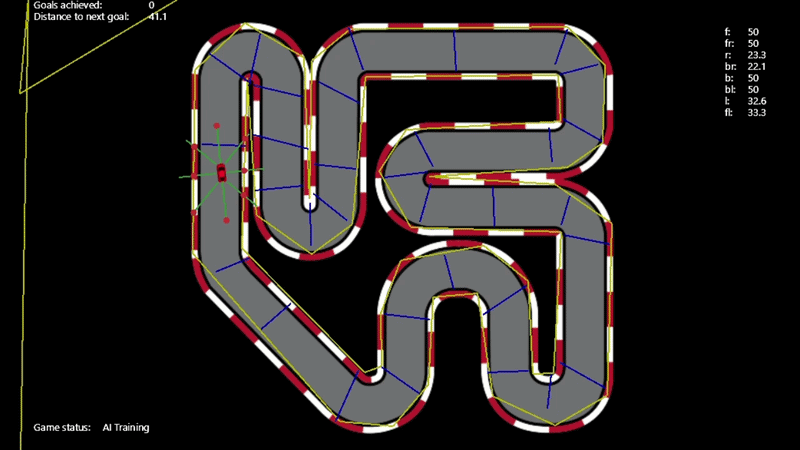
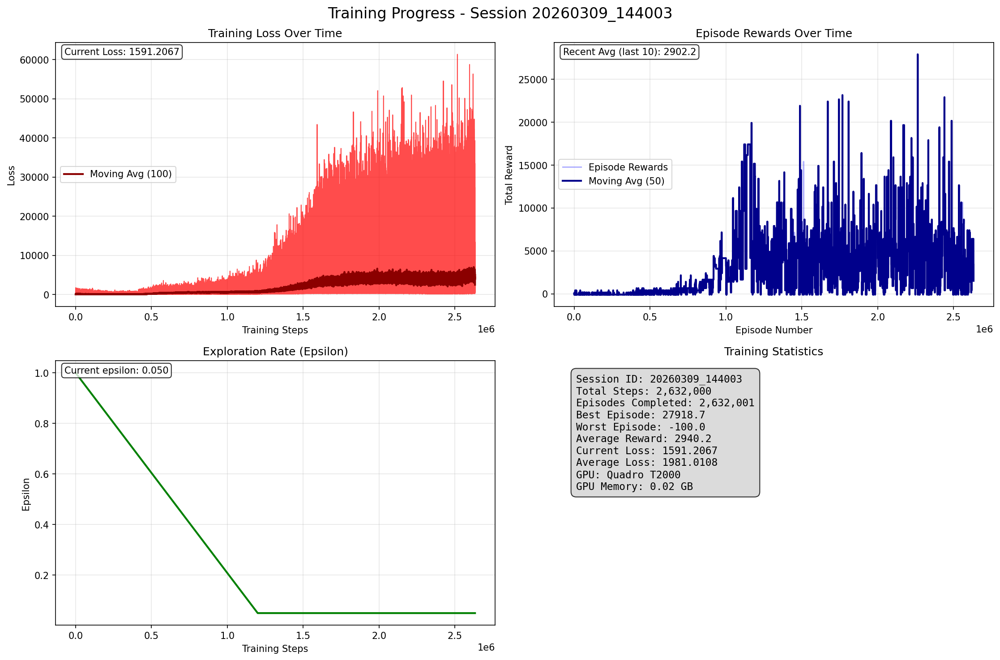

# Q-Learning Car

A 2D racing game where an AI agent learns to drive using **Double Deep Q-Learning (DDQN)**. The agent observes distance sensors and goal direction to navigate a custom-drawn track through trial and error.

## Demo



## Training Results

After ~1 million gradient steps, the agent manages has learned basic steering and is able to complete entire laps on the training circuit. 
Improvement then stagnates; one possible origin could lie in the exploration rate eventually becoming to small.


## How It Works

The agent uses a **Double Deep Q-Network (DDQN)** with experience replay and a target network:

- **State**: 11 inputs — 8 sensor distances (normalized), velocity, angle to next goal, distance to next goal
- **Actions**: 8 discrete movement directions (forward, forward-right, right, ...)
- **Reward**: +250 for crossing a goal, −100 for crashing, +0.01 per step survived
- **Network**: fully connected network with 2 hidden layers (128 → 64)
- **Training**: epsilon-greedy exploration, replay buffer of 100k transitions, target network updated every 5000 steps

Training runs live inside the game window at 60 FPS. Checkpoints are saved periodically and training can be resumed from the latest checkpoint.

## Project Structure

```
Q-Learning-Car/
├── start_training.py           # Entry point — run this to start
├── racegame.py                 # Main game loop and training orchestration
│
├── game/                       # Game simulation layer
│   ├── car.py                  # Base car physics (sensors, movement, collision)
│   ├── ai_car.py               # AI-controlled car (maps discrete actions to inputs)
│   ├── user_car.py             # Human-controlled car
│   ├── racetrack.py            # Track drawing and goal management
│   ├── game_settings.py        # Game constants and GameStatus enum
│   ├── gui.py                  # In-game HUD overlay
│   └── utils.py                # Geometry helpers (line intersection, point-to-line distance)
│
├── training/                   # Reinforcement learning layer
│   ├── network.py              # DQN architecture (PyTorch)
│   ├── rlenv.py                # Gymnasium environment wrapper
│   ├── training_config.py      # All hyperparameters in one place
│   └── training_monitor.py     # Metrics logging and plot generation
│
├── tools/                      # Standalone analysis scripts
│   ├── analyze_q_values.py     # Inspect learned Q-values from a saved checkpoint
│   └── dashboard.py            # View training session history from logs
│
├── resources/                  # Sprites (car, track background)
└── requirements.txt
```

## Quick Start

### 1. Install dependencies

```bash
pip install -r requirements.txt
```

> For GPU training, install PyTorch with CUDA support from [pytorch.org](https://pytorch.org).

### 2. Run

```bash
python start_training.py
```

### 3. Draw your track

1. **Draw Boundaries** — click to place track boundary segments, close the loop to finish
2. **Draw Goals** — click to place goal lines the agent must cross (in order)
3. **User Controls** *(optional)* — test the track manually with arrow keys
4. **AI Training** — press SPACE to start; the agent trains in real time

### Controls

| Input | Action |
|-------|--------|
| SPACE | Advance to next mode |
| Mouse | Draw boundaries / goals |
| Arrow keys | Drive (User Controls mode) |
| Right-click | Reset environment (AI Training mode) |
| ESC / close | Exit |

## Configuration

All hyperparameters are in [training/training_config.py](training/training_config.py):

| Parameter | Default | Description |
|-----------|---------|-------------|
| `LEARNING_RATE` | `1e-4` | Adam optimizer learning rate |
| `BATCH_SIZE` | `128` | Replay buffer sample size |
| `BUFFER_SIZE` | `100,000` | Experience replay capacity |
| `GAMMA` | `0.99` | Discount factor |
| `EPSILON_DECAY` | `300,000` | Env steps to decay exploration from 1.0 → 0.05 |
| `TARGET_UPDATE_FREQ` | `5,000` | Target network sync interval (gradient steps) |
| `NETWORK_HIDDEN_LAYERS` | `[128, 64]` | Hidden layer sizes |

## Training Outputs

| Path | Contents |
|------|----------|
| `models/` | Model checkpoints (`.pth`) saved periodically during training |
| `training_logs/` | Per-session metrics as JSON |
| `plots/` | Training progress plots (loss, rewards, epsilon) |

## Analysis Tools

```bash
# Inspect Q-values from the latest checkpoint
python tools/analyze_q_values.py

# View summary of past training sessions
python tools/dashboard.py
```

## Requirements

- Python 3.9+
- PyTorch
- Gymnasium
- Pyglet
- NumPy
- Matplotlib
